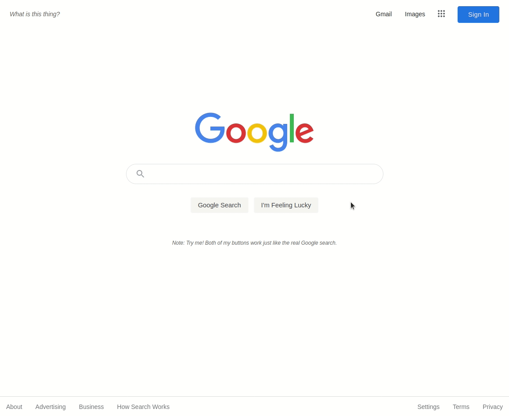

# google-homepage

A one-for-one, working clone of the Google search engine home page written on HTML and CSS. 

## Installation

For something quick and easy, head on over to https://francislangit.github.io/google-homepage/.  Try out the functionalities of the website there in real time.

Otherwise, if you'd like to run page locally or want to edit the contents of the repository:

1. Clone the repository with `git clone https://github.com/FrancisLangit/google-homepage` or download it as a `.zip` file.
2. Open up `index.html` using any web browser to view and use the website.

## Usage

Make a query using its functional search bar, surprise yourself with its I'm Feeling Lucky button, or use its navigation bars to travel across Google's wide array of services all within the convenience of a single page.

